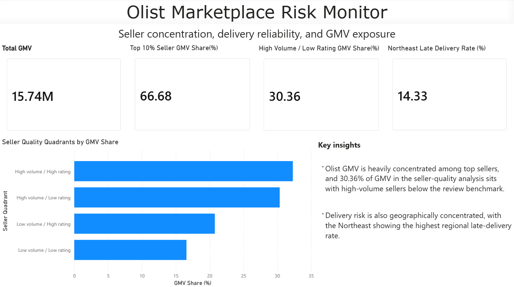
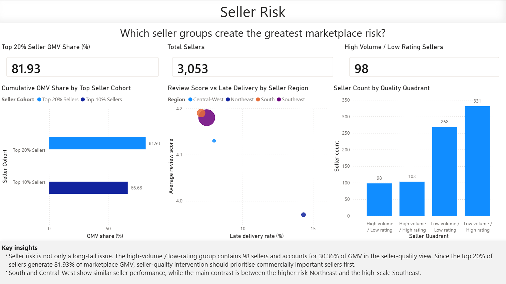
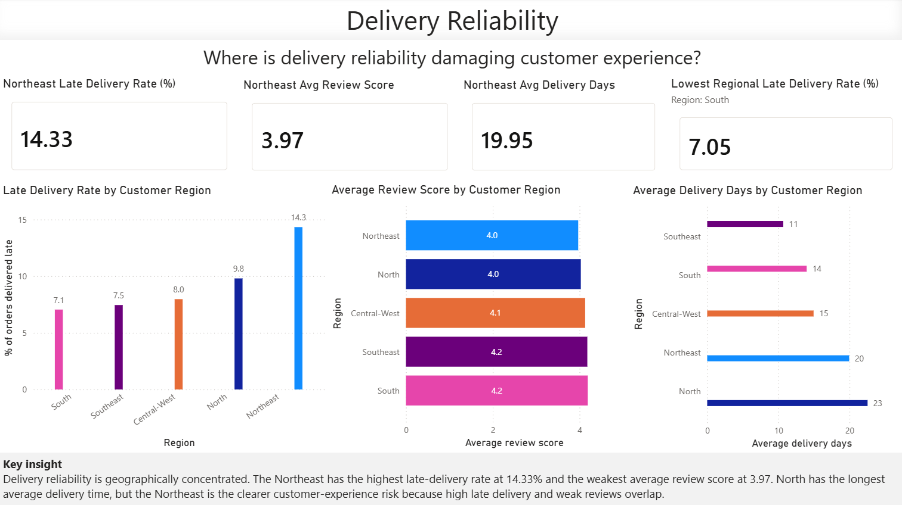
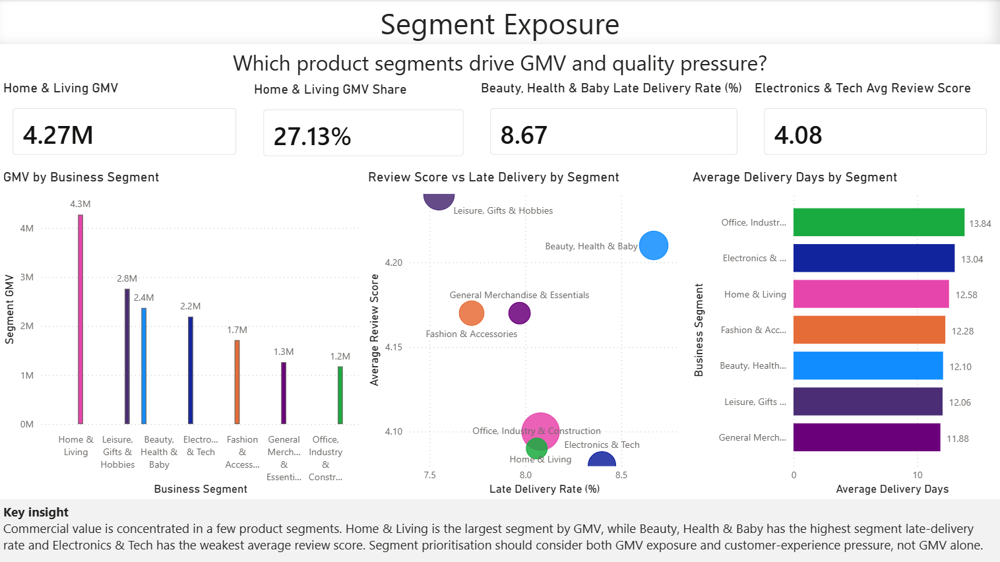

# Olist Marketplace Risk Monitor

## Executive Summary

This project analyses Olist’s marketplace performance to identify where commercial value is most exposed across seller concentration, delivery reliability, seller quality, and product segment pressure.

The analysis found that marketplace GMV is highly concentrated among top sellers, with the top 20% of sellers generating 81.93% of GMV. A commercially important seller group, high-volume sellers with below-benchmark review scores, accounts for 30.36% of GMV in the seller-quality view. Delivery issues are also geographically concentrated, with the Northeast showing the highest late-delivery rate and weakest regional review score.

The final output is a Power BI Marketplace Risk Monitor designed to help marketplace, operations, and seller management teams prioritise seller intervention, logistics improvement, and segment-level monitoring.

## Business Problem

Olist operates as a marketplace, which means performance risk can come from multiple areas: seller concentration, weak seller quality, late delivery, and product segments with poor customer experience.

The goal of this project was to answer:

**Where is marketplace value most exposed, and what should the business prioritise?**

The analysis focuses on three business themes:

1. Seller and GMV concentration risk
2. Delivery reliability and customer experience
3. Product segment exposure and quality pressure

## Key Findings

### 1. GMV is highly concentrated among top sellers

The top 20% of sellers generate 81.93% of marketplace GMV, creating concentration risk if high-value sellers underperform.

### 2. A meaningful share of GMV sits with weaker seller quality

The high-volume / low-rating seller group contains 98 sellers and accounts for 30.36% of GMV in the seller-quality view. This group should be prioritised for account management, monitoring, or seller coaching.

### 3. Delivery reliability is geographically concentrated

The Northeast has the highest late-delivery rate at 14.33% and the weakest average review score among customer regions. This suggests that logistics intervention should prioritise regions where late delivery and weak reviews overlap.

### 4. Segment prioritisation should not be based on GMV alone

Home & Living is the largest segment by GMV, but quality pressure appears in other segments as well. Beauty, Health & Baby has the highest segment late-delivery rate, while Electronics & Tech has the weakest average review score.

## Dashboard Preview

The Power BI dashboard was designed as a marketplace risk monitor, not a generic reporting dashboard. Each page answers a specific business question.

### Executive Summary

**Question answered:** Where is marketplace value most exposed?



### Seller Risk

**Question answered:** Which seller groups create the greatest marketplace risk?



### Delivery Reliability

**Question answered:** Where is delivery reliability damaging customer experience?



### Segment Exposure

**Question answered:** Which product segments drive GMV and quality pressure?



## Analytical Approach

The project followed a layered analytical workflow:

1. Audited raw Olist tables for missing values, duplicates, date issues, and grain mismatches.
2. Built cleaned fact tables at order grain and order-item grain.
3. Created summary tables for reviews and payments to avoid fan-out during joins.
4. Added reference enrichment for business segment and Brazilian region analysis.
5. Answered 12 business questions using PostgreSQL.
6. Exported validated SQL outputs into Python for chart-ready CSV generation.
7. Built a Power BI dashboard focused on marketplace risk and prioritisation.

## Data Model and Grain Decisions

A key part of this project was choosing the correct table grain for each type of analysis.

- `fact_orders_clean`: order-level fact table used for delivery performance, customer region analysis, order GMV, and review joins.
- `fact_order_items_clean`: order-item-level fact table used for category, segment, seller, and item-GMV analysis.
- `review_summary`: order-level review table used to avoid review fan-out when joining reviews to item-level or order-level facts.
- `payment_summary`: order-level payment table used for payment mix and boleto abandonment analysis.
- `category_mapping`: analyst-defined enrichment table mapping raw product categories into business segments.
- `brazil_state_reference`: regional reference table used for customer and seller geography analysis.

Separating order-grain and item-grain analysis helped prevent inflated metrics and ensured that each question used the correct base table.

## Project Workflow

```text
Raw Olist CSVs
      ↓
PostgreSQL schema load and audit
      ↓
Cleaned fact and summary tables
      ↓
Business question SQL analysis
      ↓
Python export notebook
      ↓
CSV outputs and chart assets
      ↓
Power BI marketplace risk dashboard
```

The SQL layer is the analytical source of truth. Python is used to extract validated SQL outputs into reproducible CSV files. Power BI is used as the stakeholder-facing dashboard layer.

## Tools and Skills Demonstrated

- **SQL, PostgreSQL:** data cleaning, joins, aggregations, window functions, CTEs, validation checks
- **Data modelling:** order-grain and item-grain fact tables, summary tables, reference enrichment
- **Python:** SQL extraction, pandas exports, chart generation, repeatable workflow
- **Power BI:** KPI design, dashboard storytelling, business question framing, interactive visuals
- **Analytics skills:** metric definition, grain control, fan-out prevention, business prioritisation, dashboard communication

## Repository Structure

```text
olist_marketplace_analysis/
├── data/
│   └── reference/
├── sql/
│   ├── setup/
│   ├── audit/
│   ├── modelling/
│   └── analysis/
├── notebooks/
│   └── 01_sql_outputs_to_python.ipynb
├── outputs/
│   ├── python_exports/
│   └── sql_results_summary.md
├── readme_assets/
│   ├── charts/
│   └── dashboard/
├── dashboard/
│   └── powerbi/
└── README.md
```

## How to Reproduce

1. Load the raw Olist CSVs into PostgreSQL using the setup scripts.
2. Run the audit scripts to validate raw table quality.
3. Run the modelling scripts to create cleaned fact and summary tables.
4. Run the analysis scripts to reproduce the business question outputs.
5. Use the Python notebook to export chart-ready CSVs into `outputs/python_exports/`.
6. Open the Power BI file in `dashboard/powerbi/` to view the final dashboard.

Database credentials should be configured locally using `.env.example` as a template. Real credentials are not committed.

## Limitations

- The dataset is historical and does not represent live marketplace performance.
- GMV is treated as transaction value, not audited revenue or profit.
- Product segment mapping is analyst-defined and should be reviewed with business stakeholders before production use.
- Review scores are analysed at order level, but customer sentiment text is not included in this version.
- Delivery analysis focuses on delivered orders because delivery duration is not meaningful for cancelled or unavailable orders.

## Next Steps

If this were extended into a production analytics workflow, the next steps would be:

- Materialise key SQL outputs as scheduled database views or reporting tables.
- Add seller-level drilldowns for account management prioritisation.
- Include monthly refresh logic to monitor whether interventions reduce late delivery and low review scores.
- Add margin or cost data to prioritise not only GMV exposure but profitability exposure.
- Expand customer experience analysis using review text sentiment.